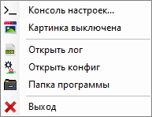

## **Свернуть рабочий стол** \- программа для сворачивания или разворачивания рабочего стола по таймеру с поддержкой установки картинки.

Используется: _Консольное приложение с поддержкой форм (.NET Framework 4.8)_

Версия языка C#: _13.0_

_Проект полностью открыт и распространяется по лицензии MIT._

Ссылки на [GitHub](https://github.com/Otto17/svernut-rabochii-stol) и [GitFlic](https://gitflic.ru/project/otto/svernut-rabochii-stol).

---

**Справка:**

_Установка интервала времени поддерживается:_  
В прямом порядке (внутри одного календарного дня), например с 11:00:00 до 17:05:10  
В инверсном виде (через полночь), например с 07:40:00 до 19:25:00

_Показ картинки:_  
Картинка берётся из этой же папки, где лежит исполняемый файл "Свернуть рабочий стол.exe"  
Название картинки может быть любым  
Поддерживаются картинки с расширениями: .jpg, .jpeg, .gif, .png  
Если в папке более одной картинки, тогда берётся первая картинка в алфавитном порядке  
Если в папке нет картинок, тогда показывается чёрный фон.

---

**Скриншот из трее:**

****

---

**Автор Otto, г. Омск 2025**